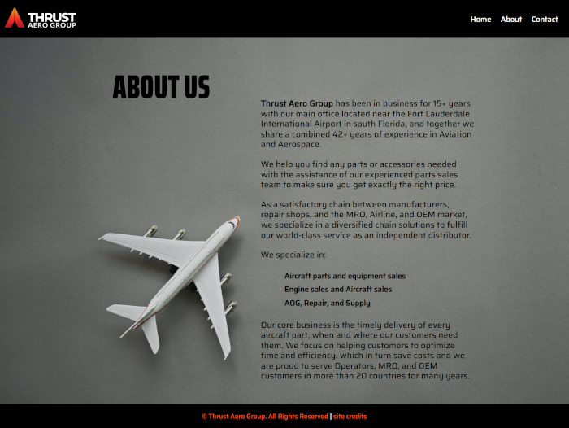

# Thrust Aero Group
  
  
          
  ## Description

  This website is a front end only design as requested by Thrust Aero Group. The client sought to refresh their existing website, and this project was carried out in collaboration with Jason Black, who played a role in the redesign process.
          
  ## Table of Contents

  * [Images](#images)
  * [License](#license)
  * [Questions](#questions)
          
  ## Images

  <strong>Thrust Aero Group | Homepage</strong>

  

   
   
   

  <strong>Thrust Aero Group | About Us</strong>

  

   
   
   

  <strong>Thrust Aero Group | Contact Us</strong>

  

          
  ## License

  
  
  
  https://opensource.org/licenses/MIT 
    
          
  ## Questions
  If you have any questions you can find my contact info below.
  * GitHub: [PeteChicchetti](https://github.com/PeteChicchetti)
  * E-mail: petechicchetti@gmail.com
  